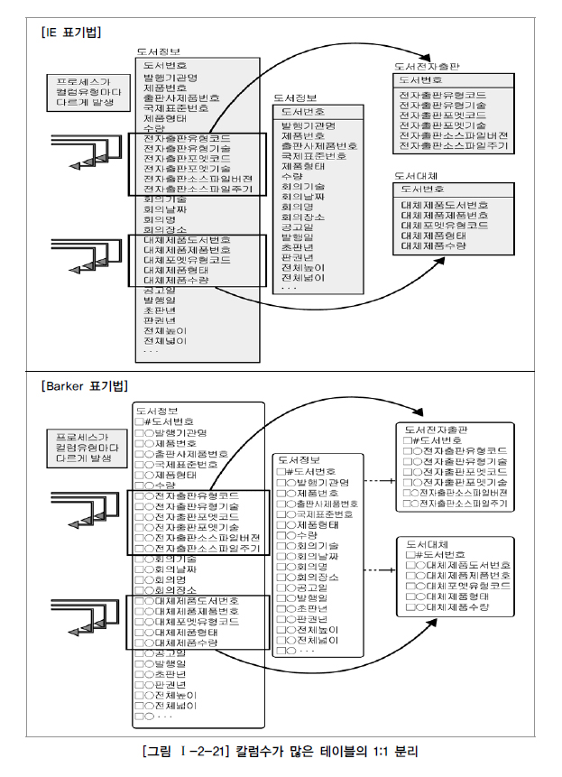

# 8. 대량 데이터에 따른 성능

링크: https://dataonair.or.kr/db-tech-reference/d-guide/sql/?pageid=5&mod=document&uid=326

# **1. 대량 데이터발생에 따른 테이블 분할 개요**

- 한개에 테이블에 너무 많은 컬럼을 갖고 있으면 느려짐과 동시에 디스크저장형식에 좋지않다.
    
    그렇기에 나누어 정보를 저장하자.
    
- 파티션을 나누어 정보를 저장도 권

