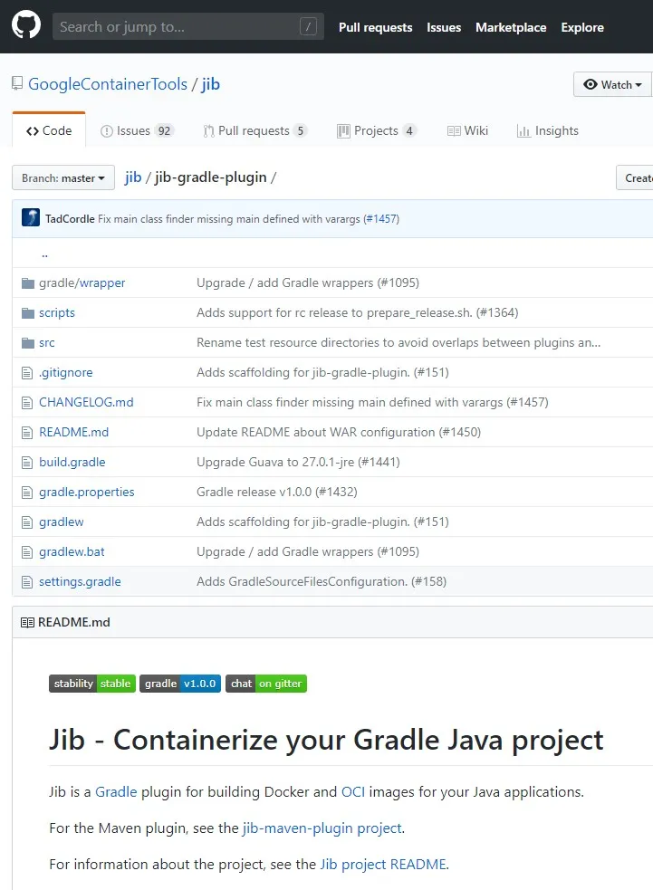

# Docker java image 만들기

docker_hub 에 이미지 올리기는 생각보다 잘 안된다 

java에 경우 intellj 에서 올리는 방법은 조금다르다.

# 1. 우선 기본적인 web 페이지 생성

(ex) spring web……)

# 2. Jib 라이브러리를 추가한다.



```java
plugins{ 
    id 'com.google.cloud.tools.jib' version '2.8.0'
}

jib.to.image = 'gcr.io/my-project/image-built-with-jib'
```

# 3. 해당 gradle 추가 후 밑에와 같이 생성확인


# 4. war 파일 생성후 jibDockerBuild 선


# 5. image 업로드 확인


