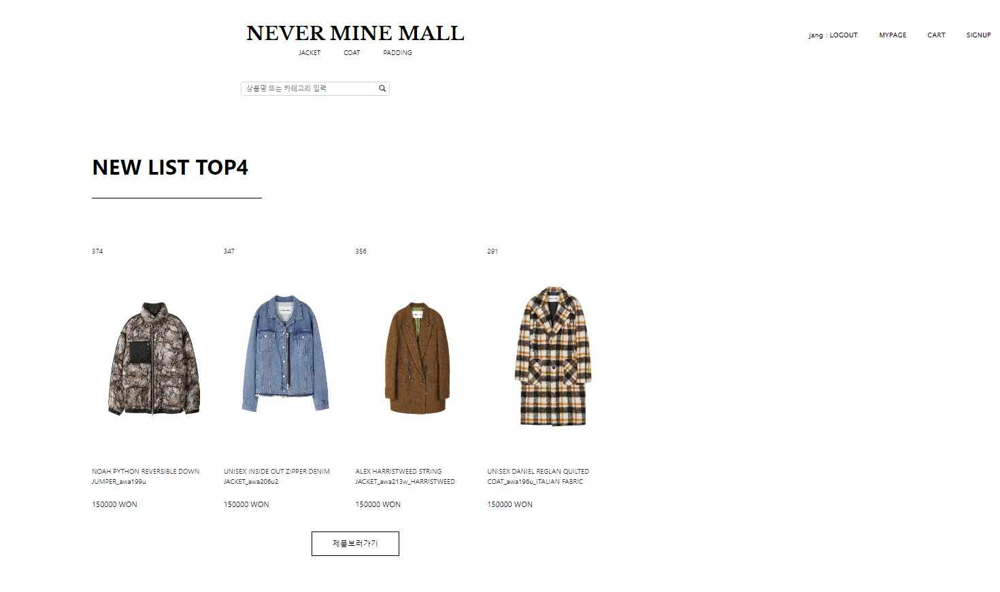

## NeverMineMall (20대 아우터 쇼핑몰)

**구 분** | **내 용**
--- | ---
**성명** | 강은택 (팀원: 장동홍, 고한별, 이나현, 노하람, 전환희)
**프로젝트명** | NeverMineMall
**개발기간/참여인원** | 2019.11.27 ~ 2019.12.08 (12일) / 6명
**개발환경 (사용언어)** | IDE: Eclipse DB: Oracle 개발언어: Java, JSP & Servlet, HTML, CSS, JS 라이브러리: jQuery, JSTL, JDBC, jqChart, 우편번호 API, 아임포트 결제 API, 카카오 로그인 API 서버: Apache Tomcat 협업 툴: Git & GitHub 프레임워크: Bootstrap

---

### 본인의 역할
- 로그인 기능 구현
- 회원가입, 탈퇴, 수정 기능 구현
- 관리자 페이지 로그인 및 회원 정보 구현
- UI, 회원 테이블 및 쿼리 작성

---

### 프로젝트 개요
오프라인에 국한되지 않고 기하급수적으로 늘어나는 온라인 구매 수요에 맞춰, 20~30대 여성을 대상으로 하는 19F/W 아우터 의류 쇼핑몰을 제작했습니다.  
소비자들이 상품 정보를 쉽게 얻고, 문의 및 요구 사항에 즉각 응답 가능하며, 24시간 이용 가능한 쇼핑몰을 제공합니다.

---

### 프로젝트 내용
- **테이블 구성**:
  - 유저, 관리자, 리뷰, 장바구니, 제품, 제품 리뷰, 관리자 아이디 등 테이블 구현
- **주요 기능**:
  - 회원가입 및 로그인 (자체 로그인 및 카카오톡 로그인)
  - 메인 페이지에서 회원 관리와 상품 판매
  - 관리자 페이지에서 통계 작성 및 회원 관리
  - 주소 API를 통한 회원가입 및 유효성 검사
  - 제품 정렬 (카테고리, 출간일, 이름순) 및 페이징 처리
  - 검색 기능 (제목, 문학사 등)
- **관리자 기능**:
  - Google Chart를 활용한 매출 및 이용자 표시
  - Ajax를 통한 실시간 배송 정보 표시
  - 유저 구매 코드 생성 및 표시
  - 구매 시간, 배송 상태, 결제 상태 표시
  - 회원 정보 권한 및 가입 시간 관리

---

### 주요 코드
- 전달되는 값을 가로채 인코딩 변환
- HTTP 요청 정보를 활용한 컨트롤러 호출
- Properties를 이용한 경로 저장 및 유지 관리

---

  
  
  

  
  
  

  
  

# 개인 프로젝트

## NamTang (도서 쇼핑몰)

**구 분** | **내 용**
--- | ---
**성명** | 강은택
**프로젝트명** | NamTang (쇼핑몰)
**개발기간/참여인원** | 2019.12.20 ~ 2020.01.23 (6명)
**개발환경 (사용언어)** | OS: Windows 10 Language: Java Server: Apache Tomcat 형상관리: GitHub Database: AWS Framework: Spring Boot, Hibernate

---

### 본인의 역할
- 시큐리티 설정
- 스케줄러 설정
- 프로젝트 기본 세팅
- 날씨에 따른 UI 변경
- 관리자 페이지 통계
- 관리자 페이지 유저, 배송 상태 표시

---

### 프로젝트 개요
도서 쇼핑몰 프로젝트로, 날씨에 따라 UI를 변경하여 사용자 경험을 개선하며, 쇼핑몰 관리자와 사용자 모두에게 직관적인 관리 및 쇼핑 기능을 제공합니다.

---

### 프로젝트 내용
- **시큐리티 설정**:
  - 로그인 구현 및 UI 커스터마이징
  - 날씨에 따른 꽃가루, 눈 효과 추가
- **카트 및 구매 기능**:
  - 제품 카트에 담기 및 수량 변경
  - 수량 변경에 따른 가격 변경
  - 구매 상태 조회 및 환불 처리
  - 팝업 창을 통한 변경
- **기타 기능**:
  - 구글 API를 통한 위치 확인
  - 메일 문의 기능
  - 제품 정렬 및 페이징 처리
  - 카테고리 분류 및 검색
- **관리자 페이지**:
  - 매출 및 이용자 표시 (Google Chart 활용)
  - 12시 자동 저장 및 갱신 (스케줄러 사용)
  - 배송 정보 및 구매 코드 실시간 표시 (Ajax 활용)
  - 회원 정보 권한 및 가입 시간 표시
  - 유저, 상품, 구매 내역, 월별 매출 테이블 관리
  - AWS를 통한 관리 및 모니터링

---

### 주요 코드
- DispatcherServlet을 통한 어플리케이션 요청 핸들링

---

  
  
  

