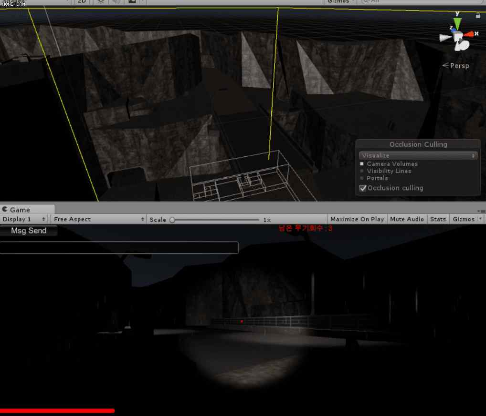
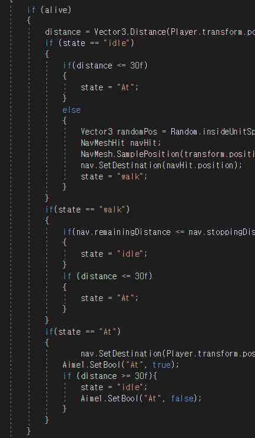
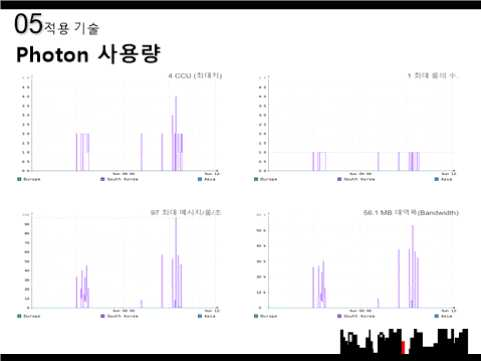
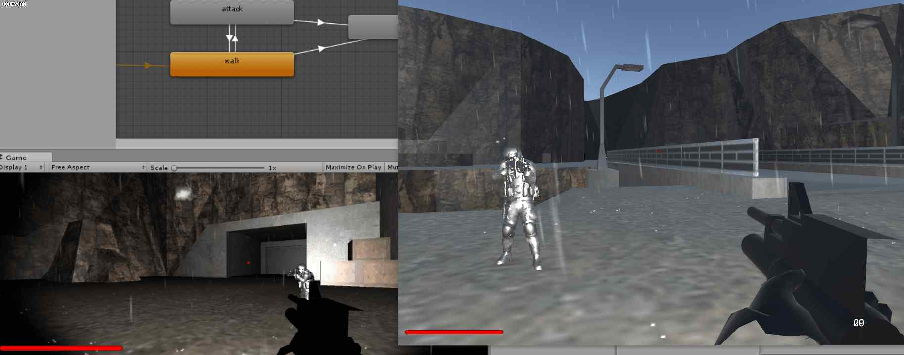
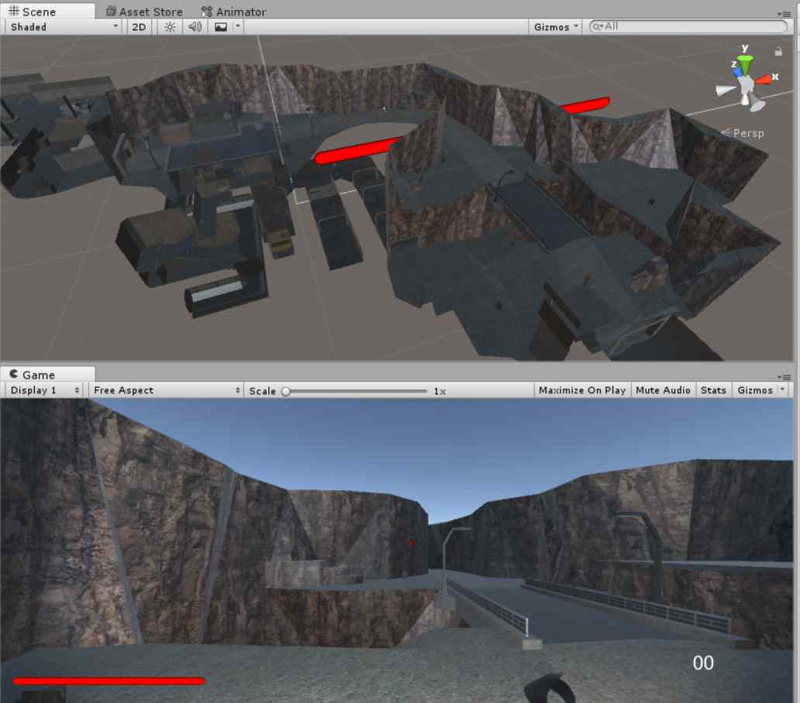
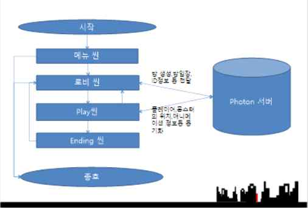

# 개인 프로젝트

## Null_Forest

**구 분** | **내 용**
--- | ---
**성명** | 강은택
**프로젝트명** | Null_Forest
**개발기간/참여인원** | 2017.09.27 ~ 2017.12.15 (30일) / 1명
**개발환경 (사용언어)** | IDE: Unity5 DB: MySQL 개발언어: C# 라이브러리: Photon, 파티클 서버: Photon

---

### 본인의 역할
- 로그인
- 인공지능 구현
- 게임 구현
- 애니메이션 구성
- 채팅

---

### 프로젝트 개요
세계 게임 시장은 계속적인 증가 추세를 보여주고 있으며, 수익 또한 증가하는 업종입니다.  
최근 그래픽의 발달과 VR 기기 사용의 증가로 호러게임의 제작 수가 증가하였습니다.  
그렇기에 호러게임을 기반으로 하는 다중접속 게임을 생각하였습니다.

---

### 프로젝트 내용
- 방만들기, 로그인
  - 로그인을 통한 게임 접속
  - 접속 시 동적 생성
  - 아이디 저장
- 플레이어가 몬스터를 피해 맵에 숨겨진 아이템을 먹거나 위치 가면 종료
- 맵 전체에 메쉬컬린더를 사용하여 세세한 부분에서 플레이어가 움직일 수 있음
- 날씨와 바람 기능 추가
- 플레이어와 몬스터 구현
- 서로 다른 PC에서 구동 시에도 Photon Cloud를 통해 멀티플레이 가능
- 똑같은 동작의 스크립트여도 자신의 PC를 구별
- 카메라 이동 시 상대 캐릭터가 쫓아서 움직이지 않음

---

### 프로젝트 이미지
#### 주요 이미지
| 이미지 | 설명 |
| --- | --- |
|  | **Unity Screenshot 1** |
|  | **Unity Screenshot 2** |
|  | **Unity Screenshot 3** |
|  | **Unity Screenshot 4** |
|  | **Unity Screenshot 5** |
|  | **Unity Screenshot 6** |
|  | **Unity Screenshot 7** |

