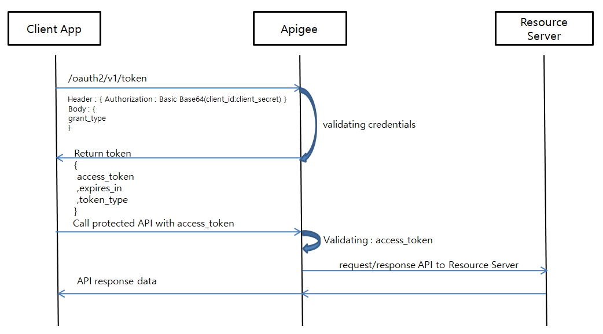

# APIgee 사용법

1. 토큰 발급
2. api호출에 토큰 정보 입력
3. api호출 및 반환


APIgee 흐름도
 


1.토큰 받아 오기
 ```java
@Value("#{applicationProp['apigee.arn']}") //접근을 위한 ARN 정보
private String secretArn;

//토큰 받기위한 함수 생성
// paxClientId,paxClientSecret 정보를 호출 token갑 반환
public void apigeeUpdateCheck(){
   try{
      // 4시간 단위로 갱신
      if (paxUpdateDate == null || Duration.between(paxUpdateDate, LocalDateTime.now()).toHours() >= 4){

         //key,id 값을 aws secretManager 저장지 호출을 통해 가져옴
         String secretIDKEY = apiGeeService.getSecretIDKEY(secretArn).replaceAll(",", ":");

         String[] spliet = secretIDKEY.split(":");
         paxClientId = spliet[1].replaceAll("\"", "").replaceAll("}", "");
         paxClientSecret = spliet[3].replaceAll("\"", "").replaceAll("}", "");
         paxUpdateDate = LocalDateTime.now();
         paxApigeeToken = apiGeeService.getToken(paxClientId, paxClientSecret);
      }
   }catch (Exception e){
      log.error(e.toString());
      paxApigeeToken = null;
   }
}

//실제 토큰 호출 및 반환부분
public String getToken(String clientId, String clientSecret) throws Exception{

    String credentials = clientId + ":" + clientSecret;
    String encodedCredentials = new String(Base64.encode(credentials.getBytes()));

    URL url = new URL(tokenUrl);
    HttpURLConnection connection = (HttpURLConnection) url.openConnection();
    connection.setRequestMethod("POST");
    connection.setRequestProperty("Authorization", "Basic " + encodedCredentials);
    connection.setRequestProperty("Content-Type", "application/x-www-form-urlencoded");
    connection.setDoOutput(true);

    String requestBody = "grant_type=client_credentials";
    connection.getOutputStream().write(requestBody.getBytes());

    int responseCode = connection.getResponseCode();
    if (responseCode == HttpURLConnection.HTTP_OK) {
        BufferedReader in = new BufferedReader(new InputStreamReader(connection.getInputStream()));
        String accessToken= null;
        String tokenType= null;
        String inputLine;
        while ((inputLine = in.readLine()) != null) {
            if (inputLine.contains("access_token")) {
                accessToken = inputLine.substring(inputLine.indexOf(":")+1).replaceAll("\"", "").replaceAll(",", "").trim();
            }
        }
        in.close();
        return accessToken;
    }else{
        return null;
    }
}
 ```

2.api호출에 토큰 정보 입력
 ```java
List<CompletableFuture<String>> apiCallFutures = new ArrayList<>();
apiCallFutures.add(apiGeeService.getApigeeData(apigeeToken, 보내는 데이터 내용));
VOList = new ArrayList<>();

public CompletableFuture<String> getApigeeData(String accessToken, List<VO> 보내는 데이터 내용) throws Exception{

    //연결시간 제한
    RequestConfig requestConfig = RequestConfig.custom().setConnectTimeout(2000).setSocketTimeout(2000).build();
    CloseableHttpClient httpClient = HttpClients.custom().setDefaultRequestConfig(requestConfig).build();

    // HTTP POST 요청 생성
    HttpPost httpPost = new HttpPost(호출 URL);

    // Authorization 헤더에 토큰 추가
    httpPost.setHeader(HttpHeaders.AUTHORIZATION, "Bearer " + accessToken);

    ObjectMapper objectMapper = new ObjectMapper();
    String jsonString = objectMapper.writeValueAsString(VO);
    // 요청에 필요한 매개변수 설정 (JSON 형태로 변환)
    String resultJsonString = "{\"numbers\":" + jsonString + "}";
    StringEntity requestEntity = new StringEntity(resultJsonString);
    requestEntity.setContentType("application/json");
    httpPost.setEntity(requestEntity);

    // CompletableFuture를 사용하여 비동기적으로 HTTP 요청 보내고 결과를 반환
    return CompletableFuture.supplyAsync(() -> {
        try {
            // HTTP 요청 수행 및 응답 처리
            HttpResponse response = httpClient.execute(httpPost);
            HttpEntity entity = response.getEntity();

            if (entity != null) {
                return EntityUtils.toString(entity, StandardCharsets.UTF_8);
            }
        } catch (IOException e) {
            log.info("Failed to send HTTP request: " + e.getMessage());
        } finally {
            try {
                httpClient.close();
            } catch (IOException e) {
                e.printStackTrace();
            }
        }
        return null;
    });
}
 ```

3. api호출 및 반환
 ```java

// 불특정 개수의 API 호출이 완료될 때까지 기다립니다.
CompletableFuture<Void> allOf = CompletableFuture.allOf(
        apiCallFutures.toArray(new CompletableFuture[0]));

allOf.get(2, TimeUnit.SECONDS);

// CompletableFuture가 완료될 때까지 기다린 다음 결과를 처리합니다.
allOf.thenRun(() -> {
    for (CompletableFuture<String> future : apiCallFutures) {
        String response = future.join();
        // 결과를 처리하거나 결합합니다.
        test1.add(response);

    }
});
 ```

